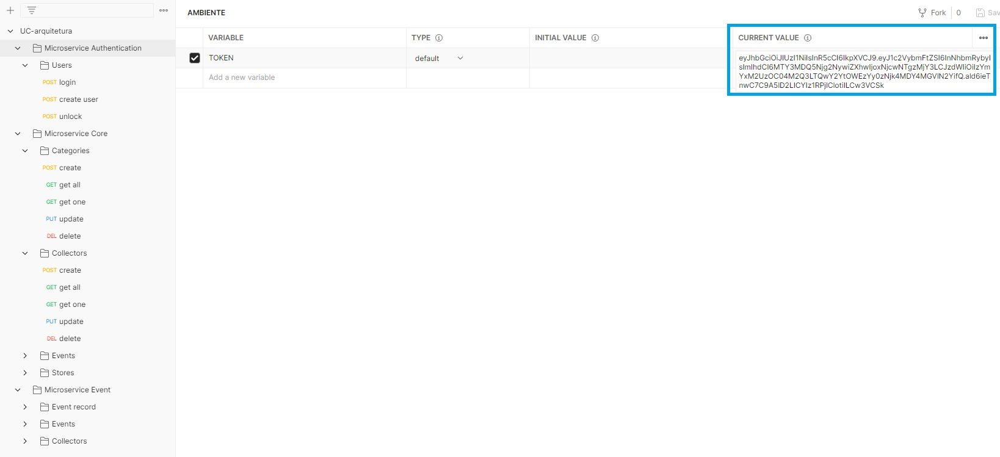

# IPCA
**Mestrado em Engenharia Informática**

Jorge Santos - 26831

Sandro Alves - 24460

**Projeto de Computação na Cloud** 

Docente Luis Ferreira

## 1. Introdução

Trabalho Prático

<p align='center'>
 
</p>

## 2. Definições

### Objetivo

Implementação do trabalho prático da UC de Projeto de Computação na Cloud com base no enunciado definido pelo docente da UC.


## 3. Tecnologias (Technologies)

- NodeJs (web server with express e typescript)
- Banco de dados PostgreSQL
- Knex migrations (cria os objetos do banco de dados)
- Bcrypt (criprografia da password no banco de dados)
- Web Token (JWT)
- RabbitMQ (serviço de mensageria)
- Elastic Search (armazenamento das informações de log)
- Kibana (visualização dos logs de acesso do serviço de autenticação)
- Swagger (para documentação dos endpoints)
- Clean Architecture com TypeScript e Express

## 4. Instalação e execução.

- [Clone](https://help.github.com/articles/cloning-a-repository/) o projeto na sua máquina executando o seguinte comando no seu terminal:

```sh
git clone https://github.com/vsandro/UC-ProjetoCloud.git
```

**Docker**

- Executar o docker-compose:

```sh
docker-compose up -d
```


**Postman**

- Use as collection do Postman para acesso aos endpoints da aplicação
- Apos login atualizar a variável de ambiente com um TOKEN de acesso válido.

```sh
UC-ProjetoCloud.postman_collection
```

<p align='center'>
 
</p>


## 6. Autoria

Este projeto foi desenvolvido pelos alunos [Jorge Santos - 26831](https://www.linkedin.com/in/filipesantos1992) e [Sandro Alves - 24460](https://www.linkedin.com/in/vsandro) conforme requisitos definidos pelo docente Luis Ferreira na UC de Projeto de Computação na Cloud.
